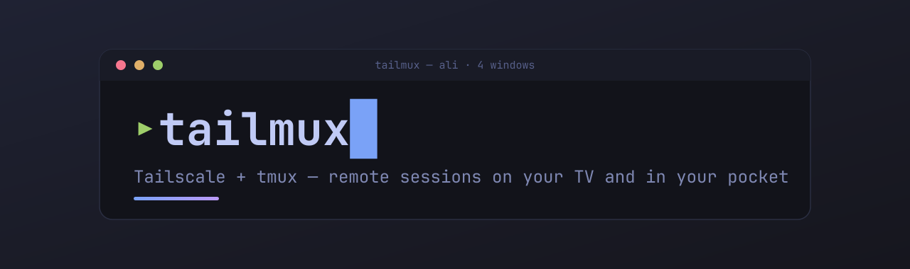

<div align="center">



<h3>Attach your remote <strong>tmux</strong> sessions over <strong>Tailscale</strong> — from the couch or your pocket.</h3>

<p>Two Android apps (TV &amp; phone/tablet) sharing one backend, wrapped in a riced <em>Tokyo&nbsp;Night</em> terminal.</p>

<p>
  
  
  
  
  
  
</p>

</div>

---

**tailmux** turns any screen into a tmux client. Point it at your [Tailscale](https://tailscale.com)
tailnet, pick a device, and attach a session — with a D-pad on the TV or your thumbs on a phone.
No port-forwarding, no bastion, no fiddly SSH configs.

## Features

- **Zero-config auth** — generates its own SSH key on first launch, `ssh-copy-id`s it on the
  first password login, then it's key-based forever. Username + password remembered per host
  (password encrypted with the Android Keystore).
- **Tailnet-native** — enumerates your devices straight from the Tailscale API. No hard-coded
  hub; online devices are flagged live. Manual `user@ip[:port]` too.
- **Made for the remote** — D-pad moves the active pane, OK zooms it, media keys resize the font.
- **Made for touch** — tappable device cards, an input bar, and voice dictation into the pane.
- **Server down? One tap** — boots tmux so [tmux-continuum](https://github.com/tmux-plugins/tmux-continuum)
  auto-restore brings your sessions back, then lists them.
- **Riced by default** — xterm.js, Tokyo Night palette, JetBrains Mono, tuned for TV overscan.
- **Self-contained** — QR-based token pairing; nothing leaves your tailnet.

## The apps

| Module | Package | Built for |
|--------|---------|-----------|
| **`:core`** | `com.cd4li.tmuxcore` | Shared backend — SSH, Tailscale API, secrets, pairing, key-gen. No UI. |
| **`:tv`** | `com.cd4li.tmuxtv` | Android **TV** — D-pad, leanback launcher. |
| **`:mobile`** | `com.cd4li.tmuxmobile` | **Phone / tablet** — touch, input bar, voice. |

## Getting started

1. **Install Tailscale** on every device — the TV box, your phone, and the machines you want to
   reach — and sign in so they share a tailnet.
2. **Generate a Tailscale API token** — [login.tailscale.com](https://login.tailscale.com/admin/settings/keys)
   → *Settings → Keys → Generate access token* (read-only is enough).
3. **Install & open tailmux** (TV or mobile).
4. **Hand it the token** — on the **TV**, scan the on-screen QR with your phone and paste it there;
   on **mobile**, paste it straight into the prompt.
5. **Pick a device** (green dot = online), then enter the **SSH username** — remembered afterwards.
6. **Authenticate** — key auth if the host has your key; otherwise the **password once**
   (tailmux `ssh-copy-id`s it for you).
7. **Choose a session** — or *New session* / *Plain shell*. Server down? Pick **Start tmux**.

## Controls

| | TV (D-pad) | Mobile (touch) |
|---|---|---|
| **Move active pane** | Arrows | Menu &rarr; pane |
| **Zoom pane** | OK | Menu &rarr; zoom |
| **Font size** | media prev / next | pinch / `A±` |
| **Text in** | popup &rarr; Voice / Type | input bar + Enter, or voice |
| **Menu** | BACK / MENU | Menu / Devices |

> tmux prefix is `Ctrl-a`.

## Build

Requires the Android SDK (platform 35, build-tools 35) and JDK 17.

```sh
./gradlew :tv:assembleDebug        # TV apk    -> tv/build/outputs/apk/debug/tv-debug.apk
./gradlew :mobile:assembleDebug    # phone apk -> mobile/build/outputs/apk/debug/mobile-debug.apk
```

Both install side by side (distinct applicationIds).

## How it works

The terminal is [xterm.js](https://xtermjs.org) in a WebView; native code owns all input and pumps
SSH bytes to it, so the remote/touch surface drives everything. SSH is [mwiede/jsch](https://github.com/mwiede/jsch)
with BouncyCastle for modern crypto. Devices come from the Tailscale HTTP API; token pairing is a
tiny embedded NanoHTTPD server the phone POSTs to.

```
core/     shared backend (com.cd4li.tmuxcore) + vendored xterm.js / JetBrains Mono
tv/       TV app       (com.cd4li.tmuxtv)
mobile/   phone/tablet (com.cd4li.tmuxmobile)
```

## Notes

- Online status is derived from each device's `lastSeen` (< 5 min).
- Token pairing serves a form over HTTP on the LAN — keep it to a trusted network.
- The app must be on the tailnet to reach `100.x` hosts; it checks and prompts if Tailscale is off.

<div align="center"><sub>Built with Tailscale + tmux · Tokyo Night · JetBrains Mono</sub></div>
